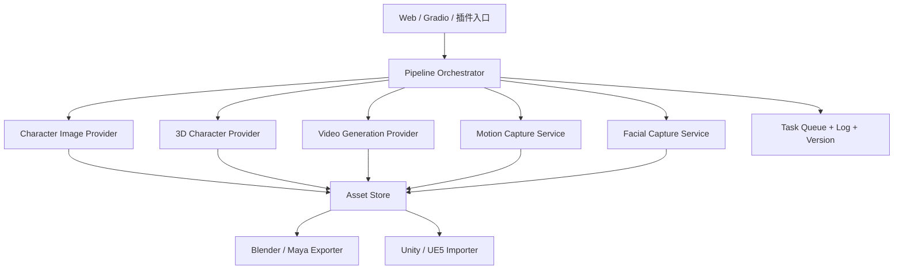

# AI 角色 / 视频 / 动捕表捕架构技术测试

**岗位方向**：游戏 AI 智能体工具工程师 / AI 算法研发 / AIGC TA 工程师  
**提交方式**：架构方案文档 + 可运行小样 + 演示录屏  
**测试重点**：不是考察美术精修能力，而是考察候选人能否把 AI 角色生成、AI 视频生成、动作捕捉、表情捕捉组织成一个可落地、可扩展、可接入游戏生产管线的工程方案。

---

## 一、测试背景

我们希望搭建一套面向游戏研发的 **AI 角色内容生产与驱动工具链**。系统需要支持从文本 / 参考图出发，生成角色概念、角色资产、角色视频，并进一步接入动作捕捉与表情捕捉，使角色可以在 DCC 或引擎中被驱动预览。

请你设计并实现一个最小可验证原型，证明这条链路在工程上可行。

> [!note] 允许使用现成模型与第三方服务
> 可使用 Stable Diffusion / FLUX / ComfyUI / Tripo / Meshy / Rodin / Hunyuan Video / Wan / Runway / 可灵 / MediaPipe / OpenPose / LiveLinkFace / Audio2Face / Blender / Unity / UE5 等任意工具。重点是架构抽象、流程组织、数据标准、可复现性和问题判断，而不是从零训练模型。

---

## 二、必做内容（100 分）

### 模块 A：整体架构方案（35 分）

请设计一套「AI 角色生成 + AI 视频生成 + 动作捕捉 + 表情捕捉」的完整系统架构。

#### 需要回答的问题

1. **系统分层**：前端 / 后端 / 任务队列 / 模型服务 / 资产存储 / DCC 或引擎插件如何拆分？
2. **流程编排**：如何把角色生成、视频生成、动作捕捉、表情捕捉组织成可重复执行的 Pipeline / DAG？
3. **模型抽象**：不同 AI 服务能力不一致时，如何设计 Provider 接口，便于替换模型？
4. **数据标准**：角色图、3D 模型、视频、骨骼动画、BlendShape 曲线、元数据分别用什么格式流转？
5. **工程可靠性**：如何处理耗时任务、失败重试、版本管理、GPU 排队、日志追踪、结果回放？
6. **游戏生产接入**：如何把结果导入 Blender / Maya / Unity / UE5，并让美术或 TA 能继续编辑？

#### 建议输出

- 一张系统架构图
- 一张流程图 / 时序图
- 核心模块说明
- 关键数据结构或接口定义
- 风险与取舍说明

#### 参考架构小样



#### 评分标准

| 子项 | 分值 |
|---|---:|
| 架构拆分清晰，可落地 | 10 |
| Pipeline 编排合理，能支持异步任务和失败恢复 | 8 |
| Provider 抽象与数据格式设计合理 | 8 |
| 能考虑 DCC / 引擎接入与资产迭代 | 6 |
| 风险、成本、性能取舍判断 | 3 |

---

### 模块 B：AI 角色生成小样（15 分）

实现一个最小角色生成链路。输入可以是文本 Prompt 或一张参考图，输出至少包含 **角色概念图 / 多视角参考 / 3D 资产或 3D 生成结果预览** 中的两个。

#### 最低要求

- 提供一个输入样例，例如：

```text
二次元写实混合风格，东方废土少年机械术士，短披风，机械右臂，轻量级战斗装备，适合 Unity 实时渲染。
```

- 生成或调用至少 1 个角色图像结果。
- 如果有 3D 生成能力，提交 GLB / FBX / OBJ 或平台预览链接；如果没有 3D 生成能力，需说明 2D 到 3D 的接口预留和后处理方案。
- 保存每一步输入、参数、输出路径，能够复现。

#### 提交物

- 角色生成演示录屏，30-60 秒
- 生成结果截图
- 工程代码或 Notebook
- 简短说明：使用了哪些模型 / API，哪些步骤是人工处理

#### 评分标准

| 子项 | 分值 |
|---|---:|
| 流程能跑通且结果可见 | 6 |
| 参数、Prompt、输出有记录，可复现 | 4 |
| 对 2D / 3D 资产标准有基本理解 | 3 |
| 接口封装清晰，后续可替换模型 | 2 |

---

### 模块 C：AI 视频生成小样（15 分）

基于模块 B 的角色结果，制作一个 **5-10 秒角色视频小样**。

#### 推荐方向，任选一种

1. **图生视频**：使用角色概念图生成角色转身、待机、挥手、攻击预备等短视频。
2. **文生视频**：直接用文本描述生成角色短片。
3. **角色一致性方案**：说明并演示如何尽量保持同一角色的脸、服装、配色一致。

#### 最低要求

- 视频长度 5 秒以上。
- 视频内容与角色设定相关。
- 提交 Prompt、关键参数、模型或平台名称。
- 简要分析视频结果的问题，例如脸漂移、肢体错误、服装不稳定、镜头不受控，并给出工程修正方案。

#### 提交物

- `mp4` 视频小样
- 视频生成配置 / Prompt 文档
- 问题分析与改进建议

#### 评分标准

| 子项 | 分值 |
|---|---:|
| 视频小样完整且主题明确 | 5 |
| 角色一致性控制思路 | 4 |
| 参数记录与可复现性 | 3 |
| 能识别并解释 AI 视频缺陷 | 3 |

---

### 模块 D：动作捕捉 + 表情捕捉小样（25 分）

实现一个最小捕捉驱动链路，证明角色可以被动作或表情数据驱动。

#### D1：动作捕捉（12 分）

输入一段 5-10 秒真人动作视频或公开视频，输出骨骼关键点 / BVH / FBX / 动画曲线，并尽量驱动到一个角色或标准骨架上。

可选工具：MediaPipe Pose、OpenPose、MoveNet、DeepMotion、Rokoko、Mixamo、UE Control Rig 等。

最低要求：
- 能看到人体关键点或骨骼动画结果。
- 能说明坐标系、骨骼命名、比例缩放、脚滑、抖动等问题如何处理。

#### D2：表情捕捉（13 分）

输入一段 5-10 秒自拍视频、口播视频或音频，输出可用于驱动角色表情的数据。

可选工具：MediaPipe FaceLandmarker、ARKit 52 BlendShape、LiveLinkFace、Nvidia Audio2Face、Wav2Lip / SadTalker 类工具等。

最低要求：
- 输出至少包含嘴部开合、眨眼、眉毛或头部转动中的 2 类信号。
- 如果没有真实角色面部绑定，可用 Debug Mesh、曲线图或简单 BlendShape Cube 证明数据可被驱动。
- 说明如何映射到游戏角色的 BlendShape / 骨骼控制器。

#### 提交物

- 动捕演示录屏，10-30 秒
- 表捕演示录屏，10-30 秒
- 捕捉数据样例，如 `.json` / `.bvh` / `.fbx` / `.csv`
- 数据映射说明：源数据字段如何映射到目标骨骼或 BlendShape

#### 表情数据结构小样

```json
{
  "fps": 30,
  "frames": [
    {
      "t": 0.0,
      "head": { "yaw": 0.02, "pitch": -0.03, "roll": 0.01 },
      "blendshapes": {
        "jawOpen": 0.35,
        "mouthSmileLeft": 0.12,
        "mouthSmileRight": 0.10,
        "eyeBlinkLeft": 0.02,
        "eyeBlinkRight": 0.03,
        "browInnerUp": 0.18
      }
    }
  ]
}
```

#### 评分标准

| 子项 | 分值 |
|---|---:|
| 动作捕捉链路能跑通 | 6 |
| 动作数据清洗、重定向问题理解 | 6 |
| 表情捕捉链路能跑通 | 7 |
| BlendShape / 骨骼映射设计合理 | 4 |
| 输出数据格式清晰 | 2 |

---

### 模块 E：工程可复现与交付质量（10 分）

#### 要求

- 提供 README，一键或少步骤启动。
- 明确依赖环境：Python / Node / CUDA / Blender / Unity / UE 版本。
- 不要把密钥写进代码仓库，第三方 API Key 用 `.env.example` 表达。
- 所有演示输入、输出、日志有固定目录。
- 如果某个环节因硬件或服务限制无法完整实现，需要给出替代 Demo 或 Mock，并说明真实接入方式。

#### 评分标准

| 子项 | 分值 |
|---|---:|
| README 清晰，可复现 | 4 |
| 目录结构和日志清楚 | 2 |
| 密钥、版权、素材来源处理合规 | 2 |
| 已知问题与后续计划明确 | 2 |

---

## 三、加分项（最多 +20 分）

| 加分项 | 分值 |
|---|---:|
| 做出一个简单 Web UI / Gradio / Streamlit / Electron 工具入口 | +5 |
| 支持 Pipeline 节点可配置，例如 JSON / YAML 工作流描述 | +5 |
| 能导入 Unity 或 UE5，展示角色 + 动作 / 表情驱动 | +6 |
| 对接 Blender 插件或脚本，自动导入资产和动画 | +5 |
| 对 AI 视频角色一致性有系统方案，如 LoRA / IP-Adapter / Reference Control / 多帧约束 | +5 |
| 使用任务队列或异步执行，并有任务状态查询 | +4 |
| 提供成本估算：本地 GPU / 云 API / 生产批量运行成本 | +3 |

---

## 四、建议提交目录

```text
候选人姓名_AI角色视频动捕测试/
├── README.md
├── 00_architecture/
│   ├── architecture.md
│   ├── system_diagram.png 或 .mmd
│   └── api_schema.md 或 openapi.json
├── 01_character_generation/
│   ├── prompts.md
│   ├── outputs/
│   └── demo_recording.mp4
├── 02_video_generation/
│   ├── video_prompt.md
│   ├── output_video.mp4
│   └── analysis.md
├── 03_motion_capture/
│   ├── input_video.mp4
│   ├── output_motion.bvh 或 .fbx 或 .json
│   └── demo_recording.mp4
├── 04_facial_capture/
│   ├── input_video_or_audio.mp4
│   ├── face_curves.json 或 .csv
│   └── demo_recording.mp4
├── 05_code/
│   ├── src/
│   ├── requirements.txt 或 package.json
│   └── .env.example
└── 06_known_issues.md
```

---

## 五、评审口径

### 通过线：65 分

- 架构讲得清楚。
- 至少 2 个小样能跑通。
- 能解释 AI 角色 / 视频 / 动捕表捕接入游戏生产时的关键坑。

### 优秀线：85 分

- 架构有工程化完整度，不只是流程图。
- 4 个模块均有可见小样。
- 数据格式和接口抽象能支持后续扩展。
- 对 DCC / 引擎 / 资产生产链路有实际理解。

### 红线问题

- 只提交概念 PPT，没有任何可运行小样。
- 无法解释自己使用的模型、接口和参数。
- 使用不可公开素材或他人作品但不说明来源。
- 把 API Key、账号 Token 直接写进代码或文档。

---

## 六、面试追问题库

1. 如果 AI 视频生成的角色脸每 2 秒就漂移，你会从模型、Prompt、Reference、后处理、镜头约束哪些角度解决？
2. MediaPipe 输出的是 2D / 3D 关键点，如何转换为游戏骨架上的旋转动画？
3. 动捕重定向中脚滑和手部穿模一般由哪些原因导致？
4. ARKit 52 BlendShape 和自定义角色面部控制器如何建立映射表？
5. 如果模型服务有本地 ComfyUI、云 API、内部推理服务三种来源，Provider 接口怎么设计？
6. 如何设计资产版本，让同一个角色的图像、3D、动作、视频结果可以追溯？
7. 这条链路中哪些环节适合异步队列，哪些环节适合同步预览？
8. 如果要从 Demo 变成团队工具，最先补齐哪三件事？

