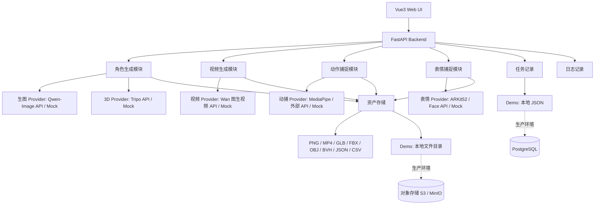
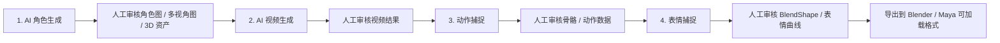

# AI 角色 / 视频 / 动捕 / 表情捕捉系统架构说明

工程启动方式：
mac上：./dev.sh start
win上：./dev_win.ps1 start

## 设计取舍

本原型采用「独立模块 + 输入输出串联」的架构，不引入复杂 DAG 编排。原因是当前链路顺序比较明确：AI 角色生成 -> AI 视频生成 -> 动作捕捉 -> 表情捕捉；同时每个模块的输出都需要人工审核后再进入下一步，因此模块独立运行、由用户选择上游产物作为下游输入，更符合实际生产流程。

## 系统架构图



## 流程图



## 核心模块

| 模块 | 输入 | 输出 | 说明 |
|---|---|---|---|
| AI 角色生成 | Prompt、参考图、风格参数 | 角色图、多视角图、GLB/FBX/OBJ、元数据 | 当前接入 Qwen-Image 生图，预留 Tripo 3D 接口 |
| AI 视频生成 | Prompt、角色图或 3D 资产 | MP4、关键帧、视频参数 | 当前接入 Wan 图生视频接口 |
| 动作捕捉 | 真人动作视频或生成视频 | 关键点 JSON、BVH、FBX | 后续可接 MediaPipe、OpenPose 或外部动捕服务 |
| 表情捕捉 | 自拍视频、口播视频或音频 | ARKit52 BlendShape、头部姿态、CSV/JSON | 用于驱动角色面部控制器 |
| 资产与任务管理 | 模块输入输出 | Job、Asset、日志 | Demo 用本地 JSON，生产环境迁移到 PostgreSQL |

## 关键数据结构

### Job

```json
{
  "id": "job_xxx",
  "module": "character",
  "status": "succeeded",
  "provider": "mock_character",
  "input": {},
  "outputs": [],
  "error": null,
  "created_at": "2026-05-18T10:00:00+08:00",
  "updated_at": "2026-05-18T10:01:00+08:00"
}
```

### Asset

```json
{
  "id": "asset_xxx",
  "type": "image",
  "module": "character",
  "job_id": "job_xxx",
  "name": "character_front.png",
  "path": "data/assets/character/job_xxx/character_front.png",
  "format": "png",
  "metadata": {}
}
```

## 接口定义摘要

```text
GET  /health

GET  /api/assets
GET  /api/assets/{asset_id}
GET  /api/assets/{asset_id}/file

POST /api/character/jobs
GET  /api/character/jobs
GET  /api/character/jobs/{job_id}

POST /api/video/jobs
GET  /api/video/jobs
GET  /api/video/jobs/{job_id}

POST /api/motion/jobs
GET  /api/motion/jobs
GET  /api/motion/jobs/{job_id}

POST /api/facial/jobs
GET  /api/facial/jobs
GET  /api/facial/jobs/{job_id}
```

## 风险与取舍

- 不做自动 DAG：当前流程固定且需要人工审核，独立模块更简单、可控。
- Demo 使用本地文件和 JSON：实现成本低，便于复现；生产环境再迁移到 PostgreSQL 和对象存储。
- Provider 先做接口预留：避免绑定单一模型服务，后续可替换 Qwen-Image、Tripo、Wan 图生视频或内部模型。
- 3D、视频、动捕结果质量依赖外部服务：系统重点放在流程组织、数据记录和可追溯性。
- Blender / Maya 接入以通用格式为主：优先输出 GLB、FBX、OBJ、BVH、JSON、CSV，暂不开发完整插件。
